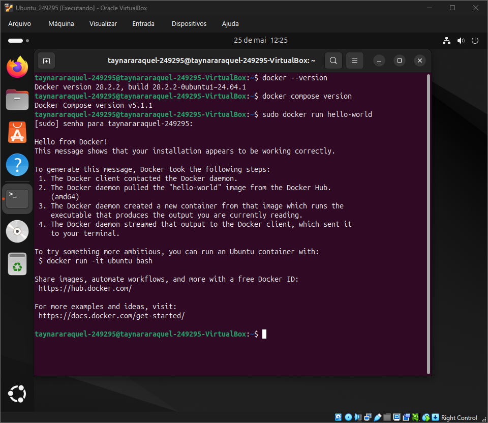
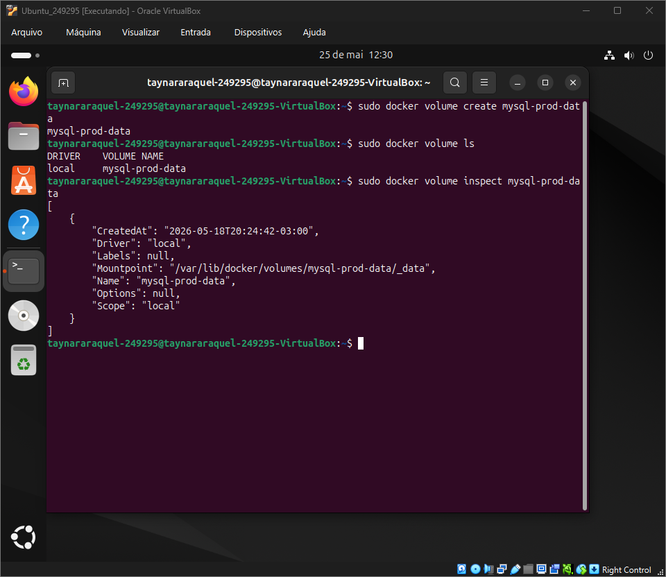
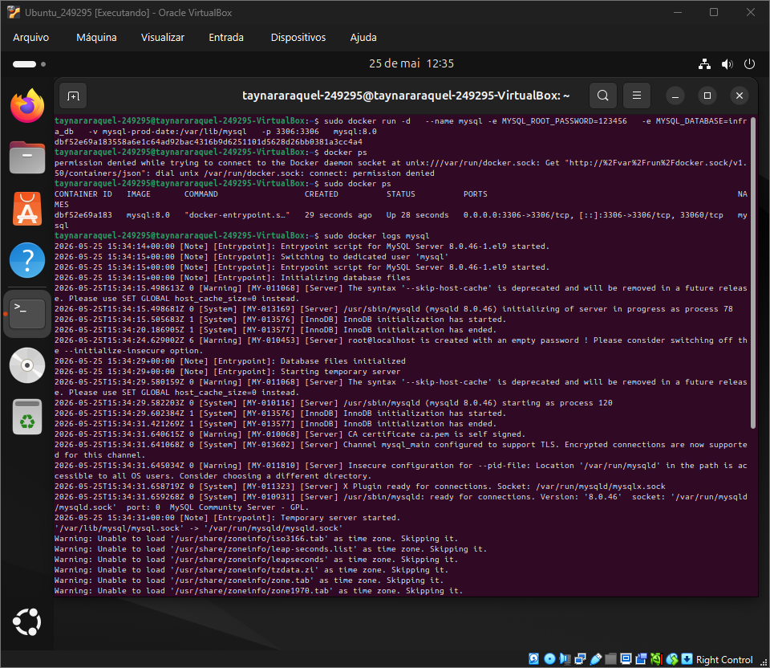
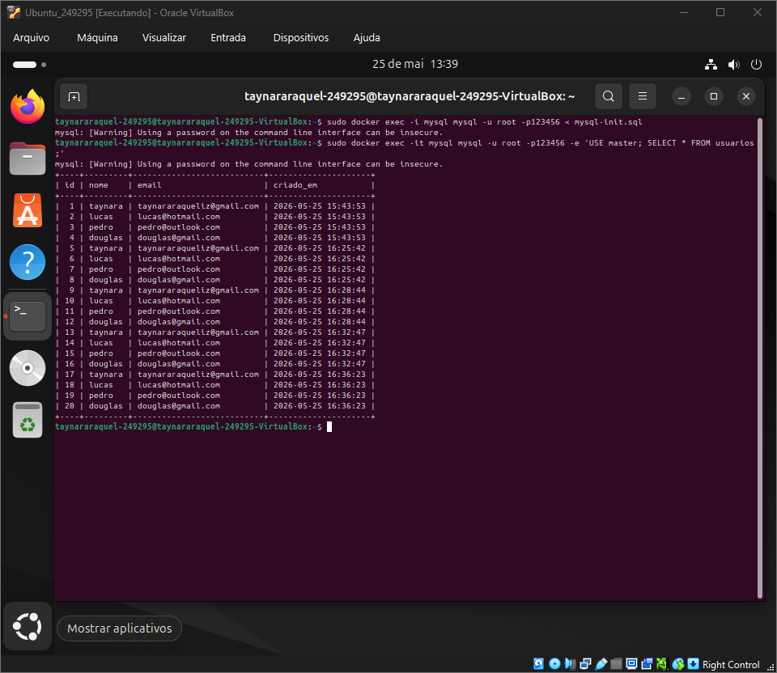
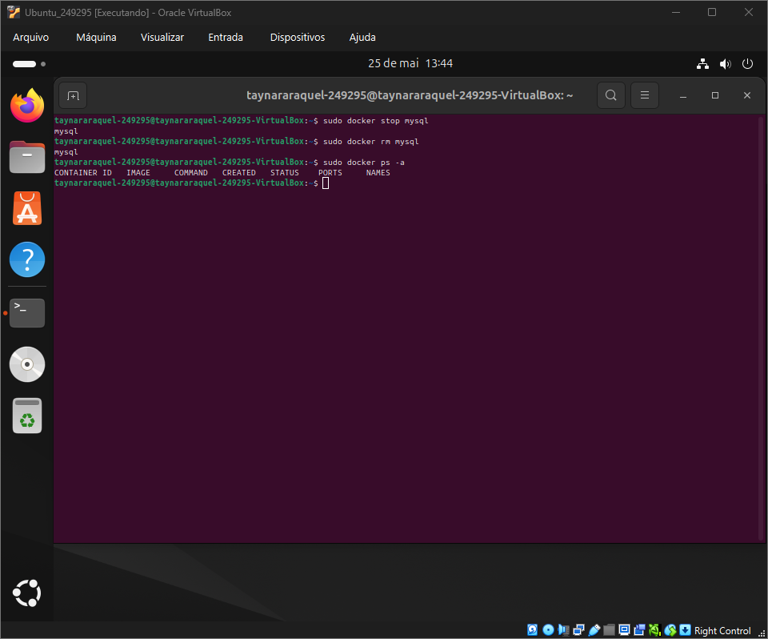
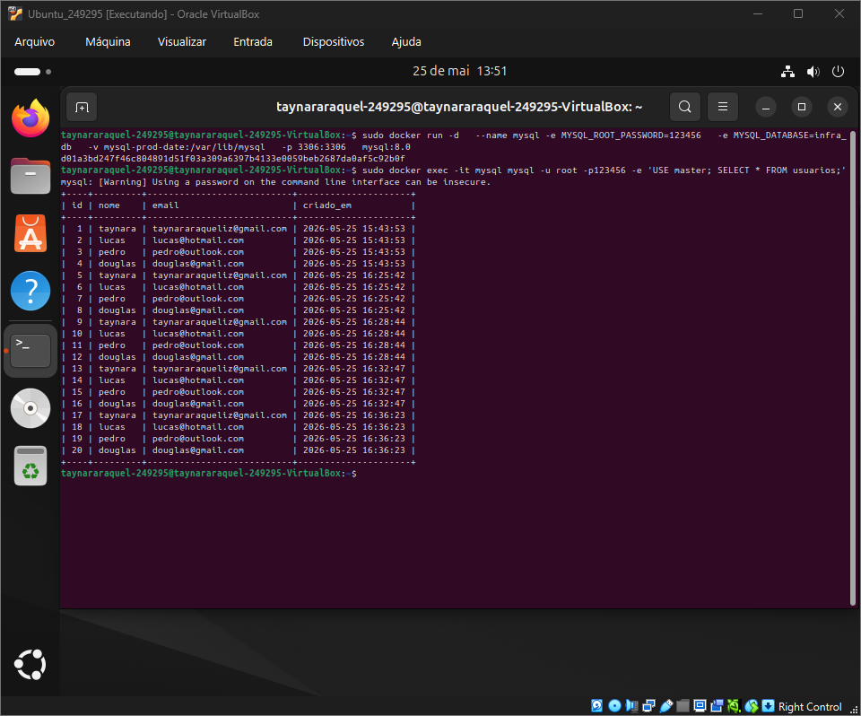
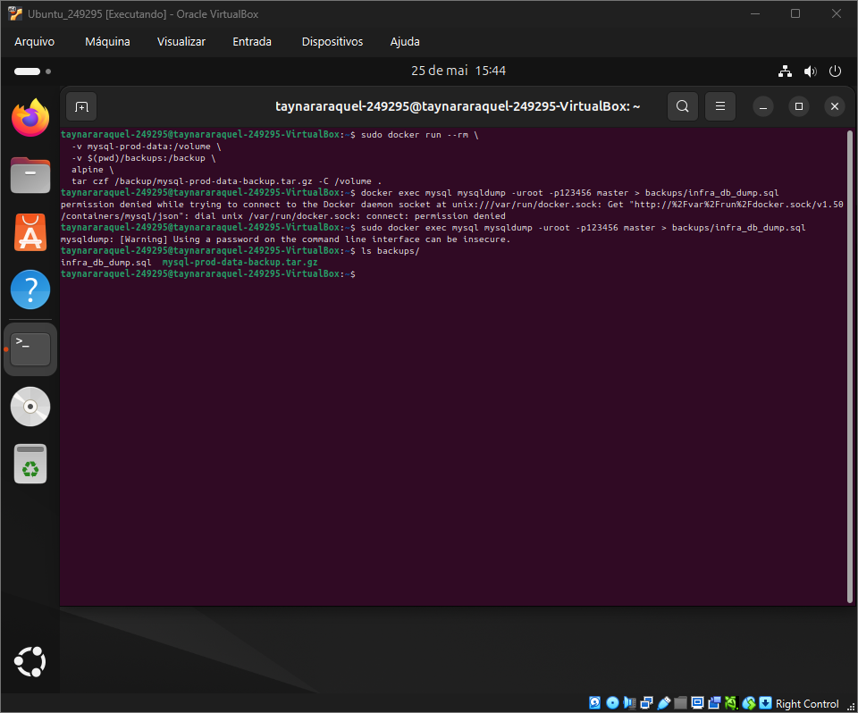
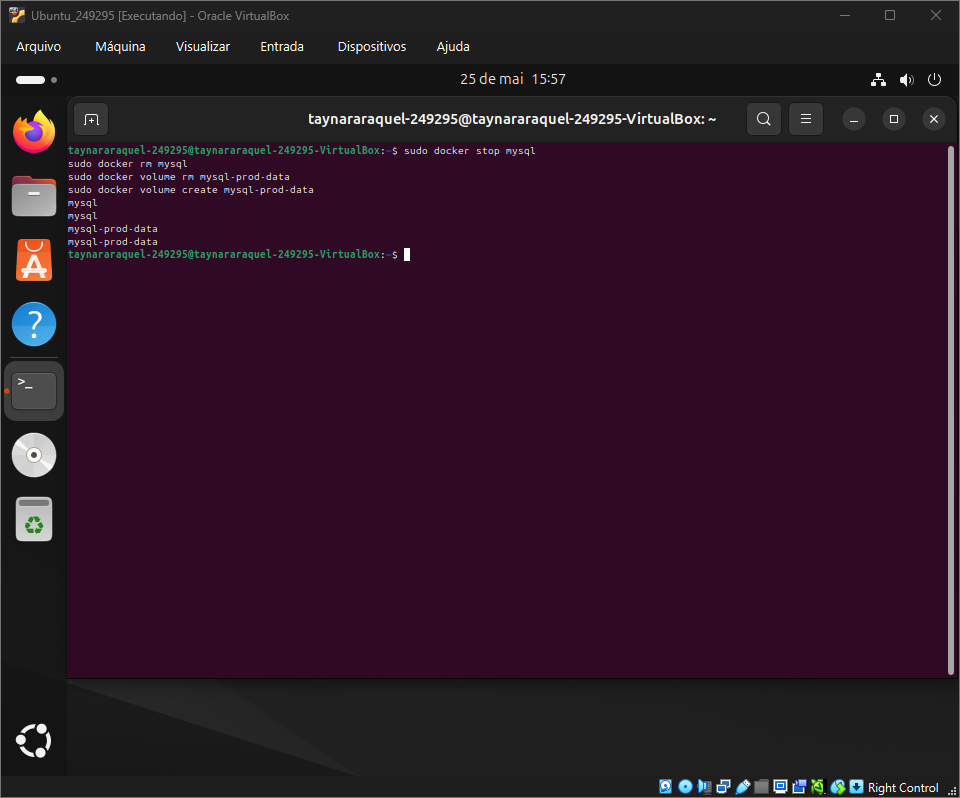
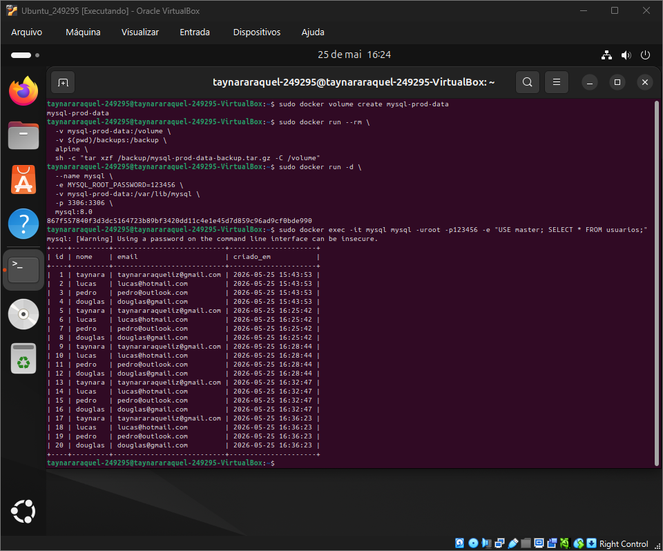
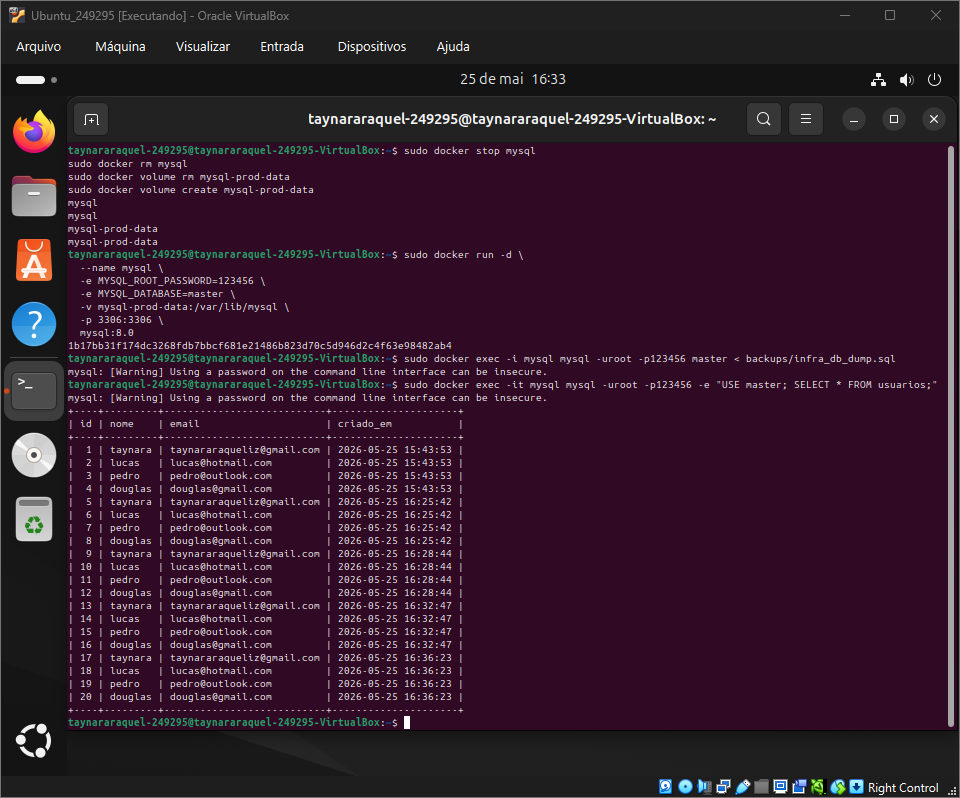

# Infraestrutura e Serviços de TI — Persistência de Dados com Docker

## Introdução

Em ambientes que utilizam containers, a persistência de dados é um ponto essencial para garantir que informações importantes não sejam perdidas durante alterações no ambiente.

Os containers Docker possuem uma característica temporária, ou seja, podem ser criados, interrompidos, removidos e recriados com facilidade. Porém, caso os dados fiquem armazenados apenas dentro do próprio container, eles podem ser apagados quando esse container for excluído.

Para evitar esse problema, o Docker permite utilizar recursos como volumes e bind mounts. Os volumes são áreas de armazenamento controladas pelo Docker e independentes do ciclo de vida do container. Já os bind mounts utilizam diretórios do próprio sistema operacional host, permitindo maior controle direto sobre os arquivos.

Nesta atividade, foi realizado um teste prático utilizando Docker para demonstrar como os dados podem permanecer disponíveis mesmo após a remoção e recriação de um container. Também foram aplicados comandos de validação, criação de volume, execução de container MySQL, inserção de dados e conferência da persistência.

---

## Ambiente Utilizado

- Sistema Operacional: Ubuntu Linux
- Docker Engine: Docker version 28.2.2, build 28.2.2-0ubuntu1~24.04.1
- Docker Compose Plugin: Docker Compose version v5.1.1
- Hardware:
  - Processador: 2 núcleos
  - Memória RAM: 4096 MB
  - Armazenamento utilizado: 15 GB

## Desenvolvimento da Atividade
### Cenario 1

Inicialmente, foi feita a verificação do ambiente Docker instalado na máquina. Essa etapa teve como objetivo confirmar se o Docker Engine e o Docker Compose estavam disponíveis para uso, além de executar um container de teste com o `hello-world`.

```bash
sudo docker --version
sudo docker compose version
sudo docker run hello-world
```



---

Após a validação inicial, foi criado um volume Docker chamado mysql-prod-data. Esse volume será responsável por armazenar os arquivos do banco de dados fora do container, permitindo que os dados sejam preservados mesmo que o container seja removido.

```bash
sudo docker volume create mysql-prod-data
sudo docker volume ls
sudo docker volume inspect mysql-prod-data
```



Em seguida, foi criado um container MySQL utilizando o volume configurado anteriormente. O volume foi montado no diretório /var/lib/mysql, que é o local onde o MySQL armazena seus dados internamente.

```bash
sudo docker run -d \
  --name mysql \
  -e MYSQL_ROOT_PASSWORD=123456 \
  -e MYSQL_DATABASE=master \
  -v mysql-prod-data:/var/lib/mysql \
  -p 3306:3306 \
  mysql:8.0
```

Depois da criação do container, foram executados comandos para verificar se ele estava em execução corretamente e para consultar seus logs iniciais.

```bash
sudo docker ps
sudo docker logs mysql-prod
```



O script SQL foi executado dentro do MySQL para criar a estrutura do banco e inserir os registros definidos na atividade.

```bash
sudo docker exec -i mysql mysql -uroot -p123456 < mysql-init.sql
```

Para confirmar que os dados foram inseridos corretamente, foi realizada uma consulta na tabela usuarios dentro do banco master.

```bash
sudo docker exec -it mysql mysql -uroot -p123456 -e "USE master; SELECT * FROM usuarios;"
```



Após validar os dados, o container MySQL foi parado e removido. Essa etapa serve para simular a perda ou recriação de um container, verificando se os dados continuam preservados no volume.

```bash
sudo docker stop mysql-prod
sudo docker rm mysql-prod
```

Em seguida, foi executada uma conferência para confirmar que o container havia sido removido corretamente do ambiente.

```bash
sudo docker ps -a
```



Depois da remoção, o container MySQL foi criado novamente utilizando o mesmo volume mysql-prod-data. Como os dados estavam armazenados no volume e não diretamente no container, eles deveriam continuar disponíveis.

```bash
sudo docker run -d \
  --name mysql \
  -e MYSQL_ROOT_PASSWORD=123456 \
  -e MYSQL_DATABASE=master \
  -v mysql-prod-data:/var/lib/mysql \
  -p 3306:3306 \
  mysql:8.0
```

Por fim, foi realizada uma nova consulta na tabela usuarios para confirmar que os dados inseridos anteriormente ainda estavam presentes, comprovando a persistência de dados através do Docker Volume.

```bash
sudo docker exec -it mysql mysql -uroot -p123456 -e "USE master; SELECT * FROM usuarios;"
```



---

### Cenario 2

Neste cenário, foi realizada a criação de backups do banco de dados utilizando duas abordagens diferentes: o backup físico do volume Docker e o backup lógico com `mysqldump`.

O primeiro backup foi feito diretamente a partir do volume `mysql-prod-data`, compactando os arquivos armazenados nele em um arquivo `.tar.gz`. Essa forma de backup preserva os arquivos físicos utilizados pelo MySQL dentro do volume.


```bash
docker run --rm \
  -v mysql-prod-data:/volume \
  -v $(pwd)/backups:/backup \
  alpine \
  tar czf /backup/mysql-prod-data-backup.tar.gz -C /volume .
```
```bash
docker exec mysql mysqldump -uroot -p123456 master > backups/infra_db_dump.sql
```



Após a criação dos backups, foi simulada uma perda de dados. Para isso, o container MySQL foi parado e removido, e o volume utilizado para armazenar os dados também foi excluído.


```bash
docker stop mysql-prod
docker rm mysql-prod
docker volume rm mysql-prod-data
```



Em seguida, foi criado novamente o volume mysql-prod-data, porém vazio. Depois disso, foi feita a restauração do backup físico, extraindo o arquivo .tar.gz para dentro do novo volume.

```bash
docker volume create mysql-prod-data

docker run --rm \
  -v mysql-prod-data:/volume \
  -v $(pwd)/backups:/backup \
  alpine \
  sh -c "tar xzf /backup/mysql-prod-data-backup.tar.gz -C /volume"

docker run -d \
  --name mysql \
  -e MYSQL_ROOT_PASSWORD=root123 \
  -v mysql-prod-data:/var/lib/mysql \
  -p 3306:3306 \
  mysql:8.0
```

Depois da restauração física, foi feita uma consulta no banco para verificar se os dados estavam disponíveis novamente.
```bash
docker exec -it mysql mysql -uroot -p123456 -e "USE master; SELECT * FROM usuarios;"
```



Na segunda forma de restauração, foi utilizado o backup gerado pelo mysqldump. Primeiro, o ambiente foi limpo novamente, removendo o container e o volume, para simular uma nova recuperação partindo de um ambiente vazio.

```bash
docker stop mysql-prod
docker rm mysql-prod
docker volume rm mysql-prod-data
docker volume create mysql-prod-data

docker run -d \
  --name mysql \
  -e MYSQL_ROOT_PASSWORD=root123 \
  -e MYSQL_DATABASE=master \
  -v mysql-prod-data:/var/lib/mysql \
  -p 3306:3306 \
  mysql:8.0

docker exec -i mysql mysql -uroot -p123456 master < backups/infra_db_dump.sql
```

Após importar o arquivo .sql, foi feita a validação dos dados dentro da tabela usuarios, confirmando que o conteúdo do banco foi restaurado corretamente.
```bash
docker exec -it mysql mysql -uroot -p123456 -e "USE master; SELECT * FROM usuarios;"
```

